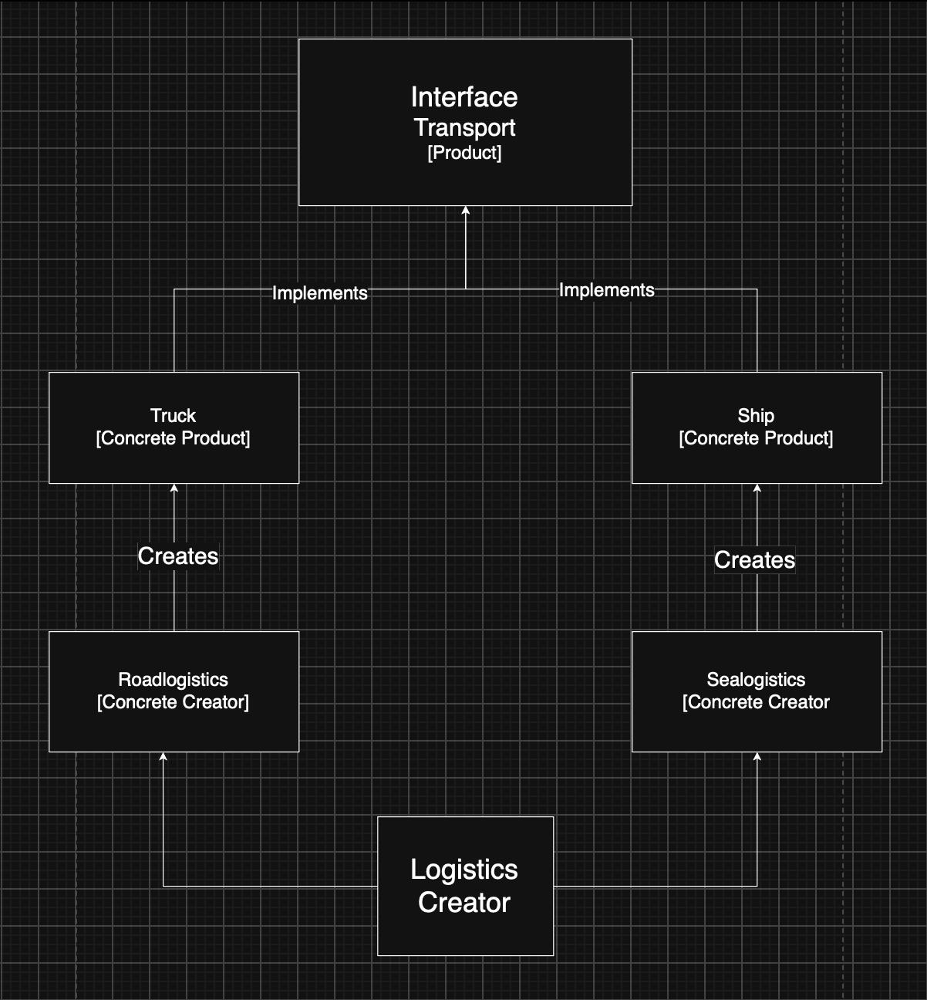
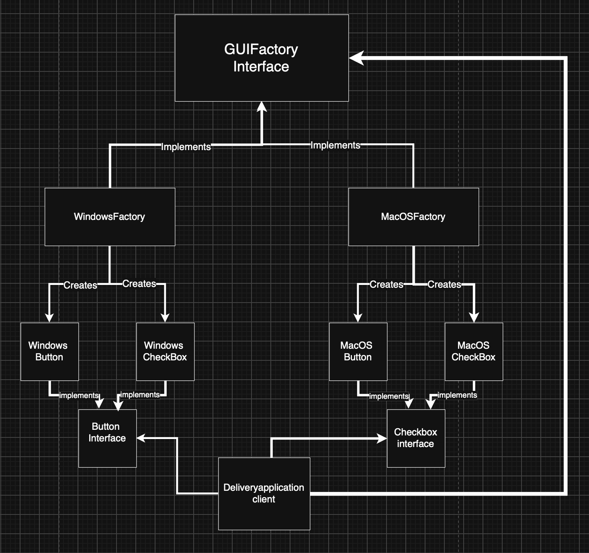

## Project Description

This is a Java logistics application built to show two design patterns working together: Factory Method and Abstract Factory.

Factory Method picks the transport for a delivery — road or sea. Abstract Factory builds the matching set of UI components for a platform — Windows or macOS. The two choices don't depend on each other and are both read at runtime.

## Features

- Road delivery using `Truck`
- Sea delivery using `Ship`
- Windows UI family: `WindowsButton` and `WindowsCheckbox`
- macOS UI family: `MacOSButton` and `MacOSCheckbox`
- Delivery mode and UI platform selected at runtime
- Input validation for unsupported values

## Design Patterns

### Factory Method

- `Transport` — Product interface
- `Truck` and `Ship` — Concrete Products
- `Logistics` — abstract Creator
- `RoadLogistics` and `SeaLogistics` — Concrete Creators

`Logistics.planDelivery()` calls `createTransport()` to get a `Transport`, then hands off the delivery through that interface — it never touches `Truck` or `Ship` directly.

### Abstract Factory

- `Button` and `Checkbox` — Abstract Products
- `WindowsButton`, `WindowsCheckbox`, `MacOSButton`, and `MacOSCheckbox` — Concrete Products
- `GUIFactory` — Abstract Factory
- `WindowsFactory` and `MacOSFactory` — Concrete Factories

Each concrete factory only ever builds its own family, so a button and a checkbox from the same factory always match.

## Project Structure

```
src/
├── factorymethod/
│   ├── Transport.java
│   ├── Truck.java
│   ├── Ship.java
│   ├── Logistics.java
│   ├── RoadLogistics.java
│   └── SeaLogistics.java
│
├── abstractfactory/
│   ├── Button.java
│   ├── Checkbox.java
│   ├── WindowsButton.java
│   ├── WindowsCheckbox.java
│   ├── MacOSButton.java
│   ├── MacOSCheckbox.java
│   ├── GUIFactory.java
│   ├── WindowsFactory.java
│   └── MacOSFactory.java
│
└── app/
    ├── DeliveryApplication.java
    └── Main.java

```

UML diagrams live in the `uml/` directory.

## Prerequisites

- Java JDK 17
- IntelliJ IDEA or another Java IDE

Nothing else — no database, no web framework, no graphical UI toolkit.

## Supported Input Values

Delivery mode:

```
ROAD
SEA

```

UI platform:

```
WINDOWS
MACOS

```

## How to Build and Run

### IntelliJ IDEA

1. Open the project in IntelliJ IDEA.
2. Set the Project SDK to JDK 17.
3. Open `src/app/Main.java`.
4. Run the `Main` class.
5. Enter a delivery mode: `ROAD` or `SEA`.
6. Enter a UI platform: `WINDOWS` or `MACOS`.

### Command Line

From the project root, compile the source files:

```
javac -d out src/factorymethod/*.java src/abstractfactory/*.java src/app/*.java

```

Run the application:

```
java -cp out app.Main

```

## Sample Run

```
Enter delivery mode (ROAD or SEA): ROAD
Enter UI platform (WINDOWS or MACOS): WINDOWS

Delivery mode: ROAD
UI platform: WINDOWS
Rendering Windows button
Rendering Windows checkbox
Truck delivers laboratory equipment to Aktau warehouse

```

Change only the delivery mode and the transport changes while the UI family stays the same. Change only the platform and both UI components change while the delivery mode stays the same.

## Validation

An unsupported delivery mode or UI platform gets a clear message, and the app stops there — it never falls back to a default or runs with a bad configuration.

Configurations tested:

- `ROAD + WINDOWS`
- `SEA + WINDOWS`
- `ROAD + MACOS`
- `SEA + MACOS`
- Unsupported delivery mode with a valid platform
- Unsupported platform with a valid delivery mode

## UML Diagrams

Two UML class diagrams are included:

- Factory Method UML diagram
- 
- Abstract Factory UML diagram
  
They show the pattern roles, the key methods, the inheritance and implementation relationships, and how the client depends on each factory.

## Technologies

- Java 17
- Factory Method design pattern
- Abstract Factory design pattern